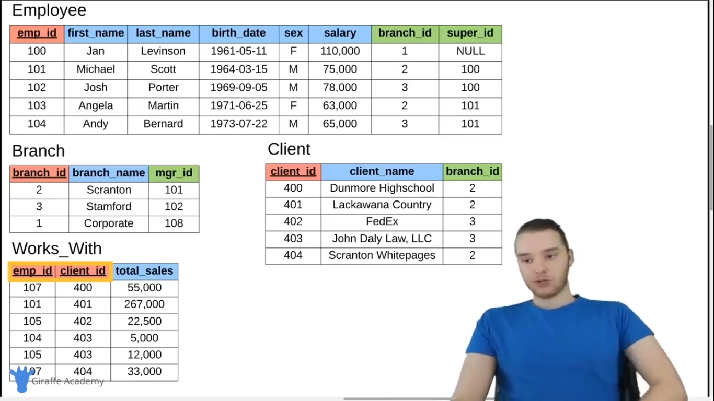

# SQL Notes

## Tables

### Composite key

This is when you define two values as your primary key. This is often done when one column alone is not enough to identify entities.

### Foreign key

A value we can store in out table that links us to values from another table.Usually the value of the foreign key is the primary key of the linked row(from the other table). 

**Employee**

| emp id | first name | salary | branch id |
| 100    | Jan        | 75,000 | 1         |
| 101    | Michael    | 78,000 | 2         |

**Branch**
| branch id| branch name| mgr id|
| 2        | Scranton   | 101   |
| 3        | Stamford   | 102   |
| 1        | Coporate   | 108   |

The foreign key between Employee and Branch table here is "branch id"

Foreign keys can also be used to define relationships between values in a single table.

For example:

| emp id | first name | salary | supervisor id |
| 100    | Jan        | 75,000 | NULL      	   |
| 101    | Michael    | 78,000 | NULL          |
| 102    | Josh       | 65,000 | 101           |
| 103    | Andy       | 63,000 | 100           |

Andy's supervisor is Jan.



**Note: Primary Key(Red),Foreign Key(Green)**


## The SQL Language


### Tables

Common datatypes

- INT : Whole Number
- DECIMAL(M,N): Decimal numbers, M: Total number of digits you want to store, N: How many of said numbers(M) are after the decimal point.
- VARCHAR(1): String of text of length 1
- BLOB: Binary Large Object, Stores large data, often used to store images or files
- DATE: 'YYYY-MM-DD'
- TIMESTAMP: 'YYYY-MM-DD HH:MM:SS' used for recording when entry was saved.

#### Creating a table

| student_id | name       | major     | 
| 1          | Jack       | Biology   | 
| 2          | Kate       | Sociology | 
| 3          | Claire     | English   | 
| 4          | Jack       | Biology   | 
| 5          | Mike       | Comp.Sci  | 

```sql
CREATE TABLE students (
	student_id INT PRIMARY KEY,
	name VARCHAR(20),
	major VARCHAR(20)
);
```

OR

A different way to assign the primary key column

```sql
CREATE TABLE students (
	student_id INT,
	name VARCHAR(20),
	major VARCHAR(20),
	PRIMARY KEY(student_id)
);
```

A table with constraints on columns.Specifically not null and unique.

UNIQUE:Values in this column have to be unique.
NOT NULL: This value can not be blank.
AUTO_INCREMENT: Automatically increment.

```sql
CREATE TABLE student(
	student_id INT AUTO_INCREMENT,
	name VARCHAR(20) NOT NULL,
	major VARCHAR(20) UNIQUE,
	PRIMARY KEY(student_id)
);
```

Creating table with a default value

```sql
CREATE TABLE student(
	student_id INT,
	name VARCHAR(20) NOT NULL,
	major VARCHAR(20) DEFAULT 'undecided',
	PRIMARY KEY(student_id)
);
```

#### Delete a table

```sql
DROP TABLE students;
```

#### Modify a table

Add a gpa column.

```sql
ALTER TABLE students ADD gpa DECIMAL(3, 2);
```

Delete gpa column.

```sql
ALTER TABLE students DROP COLUMN gpa;
```

### Inserting Data

```sql
INSERT INTO students VALUES (1,'Jack','Biology);
```

Specifiying columns

```sql
INSERT INTO students(student_id, name) VALUES (2, 'Kate');
```

### Update & Delete

Changing the major standard(how it's witten) from "Biology" to "Bio" in the students table.

```sql
UPDATE student
SET major = "Bio"
WHERE major = "Biology";
```

A more complex data update.

```sql
UPDATE student
SET major = "Bio-Chemistry"
WHERE major = "Bio"
OR major = "Chemistry";
```

Update multiple values.

```sql
UPDATE student
SET name = "Tom", major= "undecided"
WHERE student_id = 1;
```

Update every row.

```sql
UPDATE student
SET major = "undecided";
```

Delete all rows in student table

```sql
DELETE FROM student;
```

Delete specific rows

```sql
DELETE FROM student
WHERE student_id = 5;
```

Row selection (WHERE) works the same as the previous Update examples

### Basic Queries

Getting all the data in the student table.

```sql
SELECT * 
FROM student;
```

Get all the values of the name column

```sql
SELECT name,major
FROM student;
```
OR

```sql
SELECT student.name, student.major
FROM student;
```

Get name and major in aphabetical order(by name).

```sql
SELECT student.name, student.major
FROM student;
ORDER BY name;
```

Get names and major in decending alphabetical order(by major).

```sql
SELECT student.name, student.major
FROM student;
ORDER BY major DESC;
```

Order everyting by major but if two match order them by student_id.

```sql
SELECT *
FROM student;
ORDER BY major,student_id;
```

Limit the result down to two.

```sql
SELECT *
FROM student;
LIMIT 2;
```

Filter out students: Get only Biology majors.

```sql
SELECT student_id, name, major
FROM student;
WHERE major = "Biology";
```

Get all the students with the name: Claire or Kate or Mike

```sql
SELECT *
FROM student
WHERE name IN ('Claire','Kate','Mike');
```

More complex filtering

```sql
SELECT *
FROM student
WHERE name IN ('Claire','Kate','Mike') AND student_id > 2;
```

### Company Database

A more complex and realistic database.

Primary_key: Red
Foreign_key: Green


### Create Company Database
### More Basic Queries
### Functions
### Wildcards
### Union
### Joins
### Nested Queries
### On Delete
### Triggers
### ER Diagrams Intro
### Designing an ER Diagraam
## Converting ER Diagrams to Schemas
